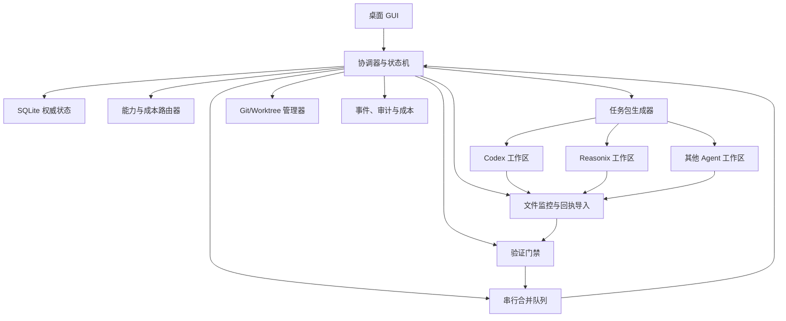

# 系统架构

## 总体结构

Bridge 是本地控制平面。它不运行模型，而是为人工打开的 Agent 生成任务材料、监控回执、执行独立验证并管理 Git 集成。



## 数据分层

### 权威状态层

`.bridge/runtime/bridge.db` 保存项目、Agent、目标、任务、尝试、租约、回执、验证、审查、合并、事件和成本。只有 Bridge 协调器可以写入。

### Agent 交换层

每个任务 worktree 拥有独立 `.bridge-task/`：

```text
.bridge-task/
├── manifest.json
├── PROMPT.md
├── TASK.md
├── CONTEXT.md
├── CONSTRAINTS.md
├── CHECKS.md
├── RECEIPT.md
├── ARTIFACTS.json
└── HEARTBEAT.json
```

Bridge 写入只读任务材料；Agent 只写回执、产物索引和心跳。代码修改发生在任务 worktree 内。

### 人类可读层

`.bridge/views/` 从数据库生成 BOARD、DECISIONS、COSTS、MERGE_QUEUE 和 AUDIT_LOG。所有视图标注 `GENERATED VIEW — DO NOT EDIT`，不能作为状态写入口。

## 核心组件职责

### Coordinator

- 执行合法状态转换；
- 在事务中更新实体版本和写事件；
- 调用其他组件，但不直接解析 Git 或文件协议细节；
- 根据推进和确认策略决定是否暂停。

### Router

- 对候选 Agent 做硬过滤和评分；
- 输出推荐负责人、审查人和解释；
- 不直接分派任务；
- 用户覆盖必须被记录。

### Package Compiler

- 将任务、上下文、约束和检查编译为协议文件；
- 根据 Agent 类型生成短启动提示；
- 生成内容哈希，保证任务包可追踪；
- 不把完整聊天历史写入任务包。

### File Watcher and Receipt Importer

- 等待文件稳定后读取；
- 校验协议、任务、尝试、租约和内容哈希；
- 对重复、过期、伪造或未完成回执给出稳定错误；
- 不直接判定任务通过。

### Workspace Manager

- 管理分支、worktree、基线、状态扫描和清理；
- 默认把 worktree 建在仓库外部；
- 不在用户主工作区执行危险切换；
- 所有写操作经过路径和归属检查。

### Validation Engine

- 验证协议、Git、修改范围、命令检查和验收证据；
- 使用参数数组启动进程，不拼接 shell 字符串；
- 归档 stdout/stderr 和退出码；
- 产生门禁结果，不直接合并。

### Merge Queue

- 在独立集成 worktree 中串行应用候选提交；
- 基于最新目标分支重新验证；
- 处理冲突、回滚和最终 commit 记录；
- 不允许 Agent 直接向主分支提交。

### Audit and Cost

- 追加记录状态事件、用户确认、路由原因和预算；
- 区分真实 token 数据与估算数据；
- 支持生成诊断包前预览和脱敏。

## 关键不变量

1. SQLite 是唯一状态真相源。
2. 任何任务状态变化都必须通过状态机。
3. Agent 回执是声明，不是验证结果。
4. 并行开发使用独立 worktree；合并串行。
5. 每个写任务必须持有租约。
6. 所有任务必须有允许范围和验收标准。
7. Git 操作必须留下可恢复的操作日志。
8. 未知状态、未知文件归属和路径解析失败均停止自动化。

## 目录建议

```text
project/
├── .bridge/
│   ├── project.yaml
│   ├── local.yaml              # gitignored
│   ├── agents/
│   ├── policies/
│   ├── views/
│   └── runtime/                # gitignored
└── BRIDGE.md                   # 托管入口区块

../.bridge-worktrees-<project>/
├── <agent-id>/<task-id>/
└── integration/
```

根 `BRIDGE.md` 只能创建新文件或更新明确的 Bridge 托管区块。用户内容在任何情况下都不得被整体覆盖。
