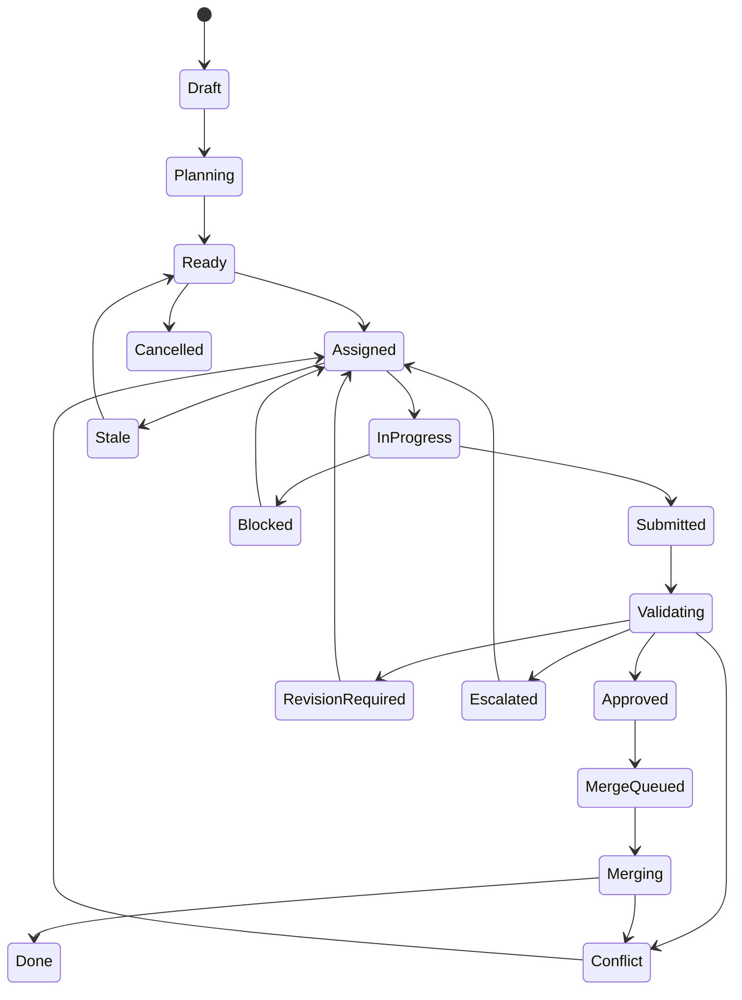

# 任务状态机与混合推进

## 状态图



## 状态定义

| 状态 | 入口条件 | 合法出口 |
|---|---|---|
| Draft | 用户创建目标或任务 | Planning、Cancelled |
| Planning | 指定规划 Agent 和规划包 | Ready、Blocked、Cancelled |
| Ready | 依赖满足、字段完整、无租约冲突 | Assigned、Cancelled |
| Assigned | Agent、attempt、租约和工作区建立 | InProgress、Stale、Cancelled |
| InProgress | 用户确认已交给 Agent | Submitted、Blocked、Stale、Cancelled |
| Submitted | 当前 attempt 回执导入 | Validating、RevisionRequired |
| Validating | 提交、范围和检查可验证 | Approved、RevisionRequired、Escalated、Conflict |
| RevisionRequired | 有具体失败证据 | Assigned、Cancelled |
| Escalated | 超过重试/预算或需要强能力 | Assigned、Blocked、Cancelled |
| Conflict | 文件、基线、接口或集成冲突 | Assigned、Cancelled |
| Approved | 所需门禁和审查通过 | MergeQueued |
| MergeQueued | 候选提交可集成 | Merging、Conflict、Cancelled |
| Merging | 独立集成环境已锁定 | Done、Conflict、RevisionRequired |
| Done | 最终 commit 和验证记录存在 | 终态；可创建回滚任务 |
| Blocked | 明确阻塞原因 | Assigned、Cancelled |
| Stale | 租约过期且未确认继续 | Ready、Assigned、Cancelled |
| Cancelled | 用户取消且现场已安全处理 | 终态 |

## 进入 Ready 的必填字段

- 标题与目标；
- 风险、复杂度和成本等级；
- 允许路径和禁止路径；
- 验收标准；
- 所需检查；
- 依赖；
- token/时间/重试预算；
- 推进策略与审批门禁。

任一缺失时保持 Draft 或 Planning。

## 推进策略

### Manual

Ready、Assigned、Submitted、Approved 和 MergeQueued 等关键转换均等待用户确认。

### Automatic

满足门禁后自动推进，但以下情况始终暂停：路径越界、状态矛盾、冲突、预算超限、高风险操作和安全底线。

### Hybrid

默认规则：

- 规划完成、架构决策和任务拆分：人工批准；
- 低成本 Agent 分派：自动；
- 回执导入和本地验证：自动；
- 普通验证失败：自动退回，最多两轮；
- 强模型升级：人工批准；
- 安全、数据库、公共接口和部署变更：人工批准；
- Low 风险合并：可自动；
- Medium 及以上合并：按安全策略确认；
- 最终项目验收：强模型审查后由用户确认。

项目策略是默认值，任务可以覆盖。每次覆盖写入事件日志。

## Attempt 与重试

每次重新分派创建新的 Attempt，不覆盖旧数据：

```text
TASK-014 / attempt 1 / reasonix / failed
TASK-014 / attempt 2 / reasonix / revision-required
TASK-014 / attempt 3 / codex consultation / approved strategy
TASK-014 / attempt 4 / reasonix / completed
```

旧回执只可审计，不得推进当前 attempt。

## 升级策略

1. 第一次失败：将具体错误、失败命令和验收缺口退给原低成本 Agent。
2. 第二次失败：缩小任务边界并补充上下文。
3. 连续失败、无进展、超预算或风险升级：创建 Escalation Package。
4. 强模型默认输出诊断或方案，不直接编码。
5. Bridge 将强模型方案重新编译成低成本实现任务。
6. 只有无法可靠委派时，才创建强模型可写任务。

## Lease 与 Stale

- Assigned 时创建租约并记录过期时间。
- Agent 更新 `HEARTBEAT.json` 或用户点击“仍在工作”可续租。
- 租约过期进入 Stale，但不会自动把任务交给其他 Agent。
- 释放前检查 worktree、未提交修改和回执。
- 用户确认释放后才允许重新指派。

## 并行判定

任务只有同时满足下列条件才可并行：

- 依赖图无先后关系；
- 允许路径不重叠；
- 不占用同一全局资源；
- 使用独立 worktree；
- 不同时修改公共接口、迁移、依赖清单或发布配置；
- 合并队列能够分别验证。

## 状态变更接口约束

任何调用必须提供：实体 ID、期望当前状态、期望版本、目标状态、actor、correlation ID 和理由。当前状态或版本不一致时返回冲突，不做“最后写入者获胜”。
