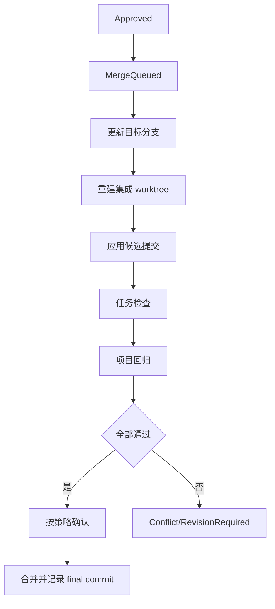

# Git、Worktree、租约、验证与回滚

## 基本原则

- Agent 可以并行开发，合并必须串行。
- Agent 不直接向主分支提交或 push。
- Bridge 不在有用户未提交修改的主工作区切换分支。
- 所有候选变更在独立集成 worktree 中重新验证。

## Worktree 位置与分支

```text
../.bridge-worktrees-<project>/
├── <agent-id>/<task-id>/
└── integration/
```

任务分支格式：

```text
bridge/<agent-id>/<task-id>/a<attempt>
```

创建前检查 Git、目标分支、未完成 merge/rebase、路径归属、租约、磁盘空间和目录冲突。

## 文件与全局资源租约

租约记录规范化路径、模式、任务、attempt、Agent 和过期时间。冲突判断必须处理 glob、Windows 大小写、符号链接和父子目录。

默认全局资源：

```text
GLOBAL:dependency-manifest
GLOBAL:database-schema
GLOBAL:public-api
GLOBAL:deployment
GLOBAL:release-config
```

占用全局资源的任务默认不与其他写任务并行。

## 提交要求

- 当前分支与 manifest 一致；
- 至少一个任务提交；
- 工作区干净且无未知未跟踪文件；
- HEAD 与回执 submission commit 一致；
- 父提交关系合法；
- 实际 diff 未越界；
- 没有提交 runtime、密钥、本地配置或任务 manifest；
- commit trailer 包含 task、attempt 和 agent。

## 验证门禁

1. Protocol：协议字段、身份、版本、重复和当前 attempt。
2. Git：分支、提交、基线、工作区和 changed files。
3. Scope：允许路径、禁止路径、全局资源、依赖、迁移和大文件。
4. Automated Checks：测试、lint、类型、diff、密钥和可选漏洞扫描。
5. Acceptance：每个 AC 映射到独立证据。
6. Review：根据风险要求低成本审查、强模型审查或用户批准。

## 串行合并队列



单提交任务优先 cherry-pick；需要保留多提交历史时受控 merge。Bridge 永不自动 force push。

## 基线过期

- 无文件重叠：在最新集成 worktree 重新应用和验证。
- 可自动解决的重叠：仍需完整验证。
- 文本或语义冲突：创建独立冲突任务。
- 公共接口冲突：升级架构审查。
- 不要求 Agent 自行随意 rebase。

## 共享目录模式

- 项目级独占写锁；
- 分派前干净工作区和快照；
- 工作期间禁止其他写任务；
- 外部修改立即暂停；
- 完成后必须提交或明确放弃；
- 只用于串行任务。

## 回滚

合并前删除临时集成 worktree即可，保留 Agent 分支。合并后使用 `git revert` 创建可审计提交，不使用 reset hard 重写共享历史。

数据库状态变化与事件在同一事务中；Git 操作使用 `OperationPrepared → Git → OperationCompleted/Failed` 操作日志。

## 崩溃恢复

启动扫描：未完成操作、残留集成 worktree、merge/cherry-pick 状态、脏 Agent worktree、数据库/Git HEAD 矛盾。每项提供继续、回滚、保留现场和查看详情。无法判断时不自动清理。

## 清理规则

- 已合并且干净的任务 worktree 可按策略自动清理；
- 未合并分支保留恢复窗口；
- 有未提交修改、未知文件或活跃租约时禁止自动删除；
- Bridge 只能删除带有自身归属元数据且位于配置 worktree root 内的目录。
